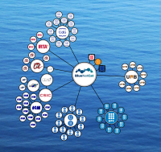

# BlueNetCat - Acció 4
Website for development and demonstrations of web apps for the BlueNetCat. The goal of action 4 is to capitalize the data collected by the researchers of the network.

## Network app
Visualize all the partners of the BlueNetCat here: https://bluenetcataccio4.github.io/network/

#### Funding
This project has been financed by the "Generalitat de Catalunya" and by the European Union through the "Fons Europeu de Desenvolupament Regional" (FEDER).

